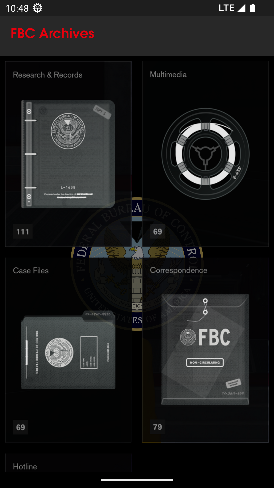
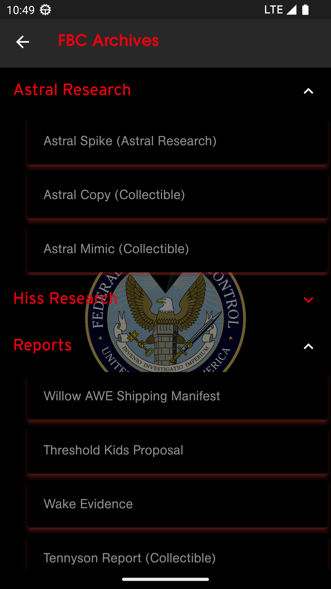
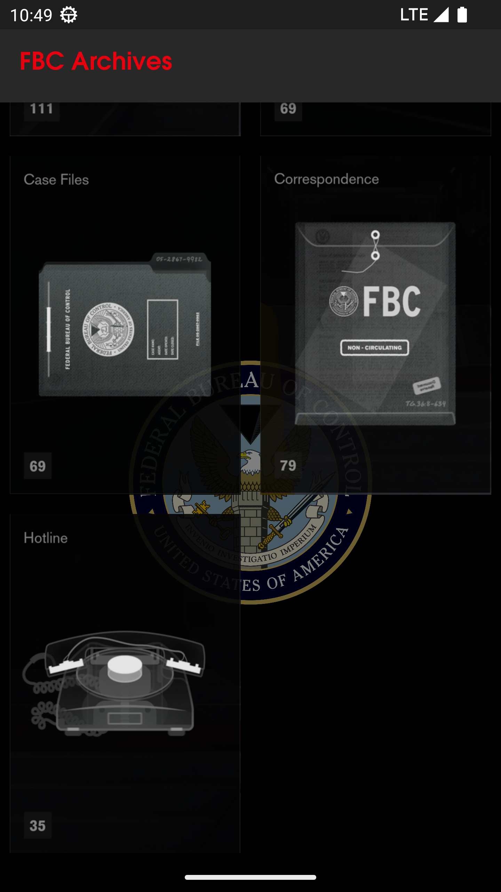
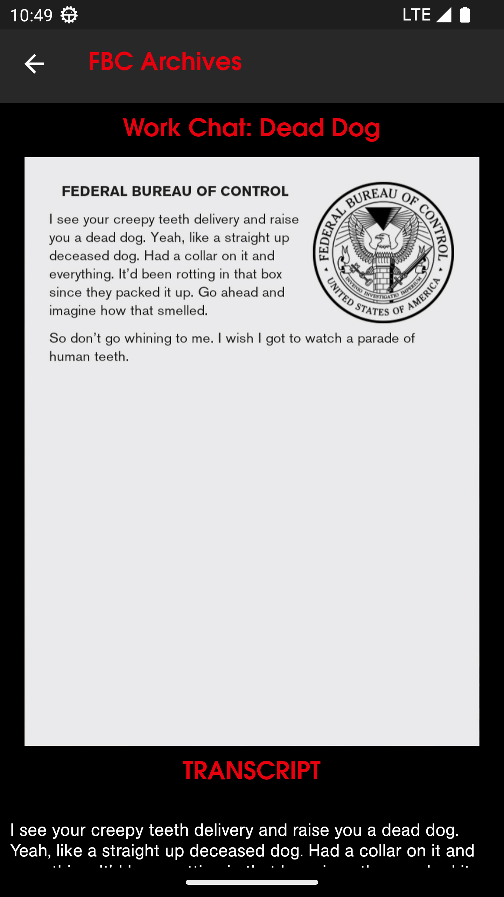
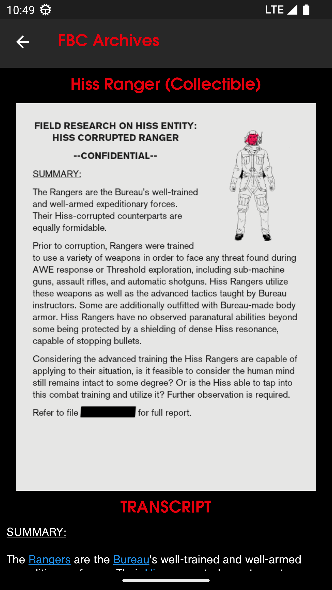

# Mobile App to view collectibles from 2019 video game [Control](https://en.wikipedia.org/wiki/Control_(video_game)) by Remedy Entertainment.

### Data scraped using Python Scrapy library and stored in Firebase Realtime database. Flutter frontend for mobile application

## Folder structure

- controlscrape: Scrapy code
- control_lore: Flutter application

## To Do
- Scrape multimedia youtube links and add to mobile app as url redirect button
- Add local json load and parsing instead of firebase dependency.
- QA System hosted on server(Provided I get resources to host the models lol)
## Images
  
  
 &nbsp;&nbsp;&nbsp;&nbsp;&nbsp;&nbsp;
 &nbsp;&nbsp;&nbsp;&nbsp;&nbsp;&nbsp;
 &nbsp;&nbsp;&nbsp;&nbsp;&nbsp;&nbsp;
 &nbsp;&nbsp;&nbsp;&nbsp;&nbsp;&nbsp;
 &nbsp;&nbsp;&nbsp;&nbsp;&nbsp;&nbsp;
