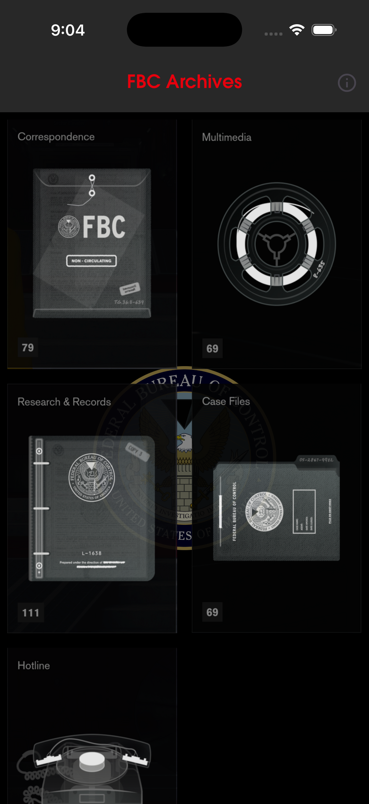
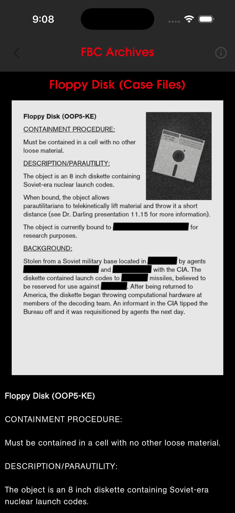
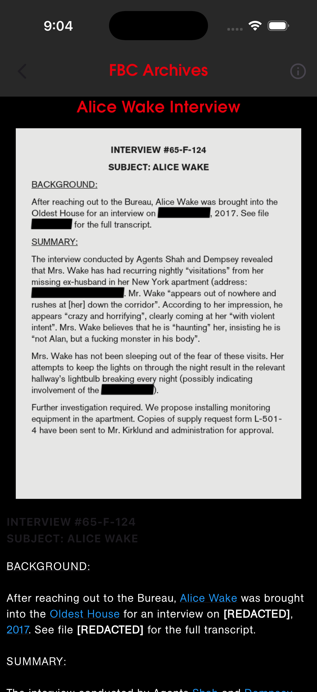
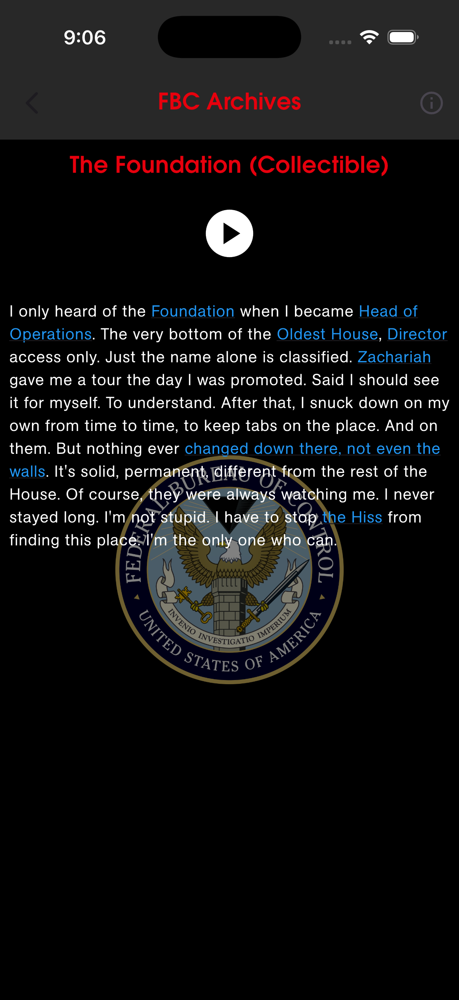
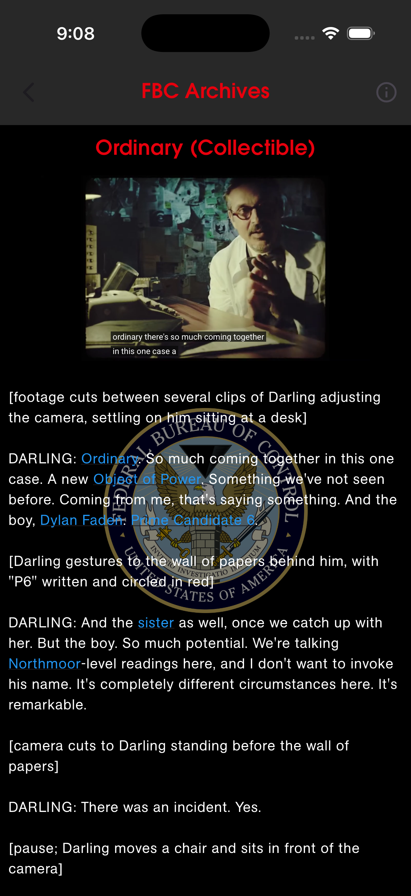

<!-- # Mobile App to view collectibles and from 2019 video game [Control](https://en.wikipedia.org/wiki/Control_(video_game)) by Remedy Entertainment. -->

# [Control](https://en.wikipedia.org/wiki/Control_(video_game)) themed wiki app.


### Data queried using MediaWiki API. 
### Flutter frontend for mobile application. 
<!-- Gemini Question Answering System added -->

## Folder structure

- controlscrape: API
- control_lore: Flutter application 

## Setup for mobile app 
Prerequistes - Flutter SDK. [How to Install](https://docs.flutter.dev/get-started/install)   
Clone the gemini_qa branch and cd into control_lore folder to run the following commands.  
    
    flutter pub get 
    flutter run 

To use the Gemini API, you'll need an API key. If you don't already have one, 
create a key in Google AI Studio: https://aistudio.google.com/app/apikey.

When running the app, include your API key using the `--dart-define` flag:

```bash
flutter run --dart-define=API_KEY=$GEMINI_API_KEY
```

If you use VSCode, you can [specify `--dart-define`
variables](https://dartcode.org/docs/using-dart-define-in-flutter/) in your
launch.json file.

If you use Android Studio or IntelliJ you can use run / debug configurations
(https://www.jetbrains.com/help/idea/run-debug-configuration.html).

## To Do
- ~~Scrape multimedia youtube links and add to mobile app as url redirect button~~
- ~~Add local json load and parsing instead of firebase dependency.~~

## Images
<br></br>
 &nbsp;&nbsp;&nbsp;&nbsp;&nbsp;&nbsp;
 &nbsp;&nbsp;&nbsp;&nbsp;&nbsp;&nbsp;
 &nbsp;&nbsp;&nbsp;&nbsp;&nbsp;&nbsp;
 &nbsp;&nbsp;&nbsp;&nbsp;&nbsp;&nbsp;
 &nbsp;&nbsp;&nbsp;&nbsp;&nbsp;&nbsp;
